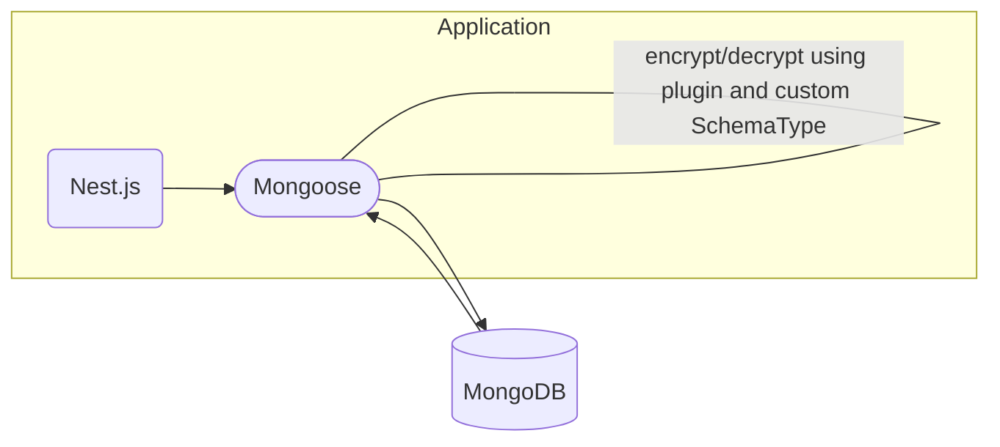

# mongoose-encrypt-fields

`mongoose-encrypt-fields` provides a Mongoose [plugin](https://mongoosejs.com/docs/plugins.html) and a [custom SchemaType](https://mongoosejs.com/docs/customschematypes.html) that encrypt and decrypt individual fields.

The goal of this plugin is to perform field-level encryption and decryption at the ODM layer, allowing applications to use it without worrying about the logic.

This plugin is for use cases where Mongoose is used in Nest.js.



## Installation

```bash
# pnpm
pnpm add mongoose-encrypt-fields
# npm
npm i mongoose-encrypt-fields
# yarn
yarn add mongoose-encrypt-fields
```

## Usage

### Basic usage

The plugin provides the `EncryptedString` [SchemaType](https://mongoosejs.com/docs/schematypes.html). To encrypt and decrypt, import and use this SchemaType.

```typescript
import { Schema as MongooseSchema } from 'mongoose'
import { EncryptedString } from 'mongoose-encrypt-fields'
import { Schema } from 'mongoose' // Also accessible as Schema.Types.EncryptedString
```

Specify the field's `type` as `EncryptedString`. If the original type is not String, specify the original type in the `originalType` field.

Non-string fields are encrypted and decrypted using `EJSON.stringify()` and `EJSON.parse()` with `{ relaxed: true }`. For more information, check the [MongoDB Extended JSON format](https://www.mongodb.com/docs/manual/reference/mongodb-extended-json/).

This behavior is the same as the PyMongo's [json_util](https://pymongo.readthedocs.io/en/stable/api/bson/json_util.html).

```typescript
@Schema()
export class User {
  @Prop(EncryptedString) // String
  uniqueId!: string

  @Prop({ type: EncryptedString, originalType: [Number] }) // non-String
  coordinates!: number[]
}
```

You can also use it without any restrictions in SubDocuments.

```typescript
@Schema()
export class UserSubDocument {
  @Prop(EncryptedString)
  uniqueId!: string
}

@Schema()
export class Review {
  @Prop(UserSubDocument) // subDocument
  subUser!: UserSubDocument

  @Prop([UserSubDocument]) // subDocument array
  subUsers!: UserSubDocument[]
}
```

You also need to inject the encryption functions into the SchemaType using `EncryptedString.setEncryptionFunctions()`. (This only needs to be called once in the code.)

However, if you apply the plugin described later, this part can be omitted.

- `decrypt`: Function to decrypt an encrypted string to plain text
- `encrypt`: Function to encrypt plain text to an encrypted string
- `isEncrypted`: Function to determine if a string is encrypted

```typescript
const myEncrypt = (value: string): string => {
  // logic
}
const myDecrypt = (value: string): string => {
  // logic
}
const myIsEncrypted = (value: string): boolean => {
  // logic
}

// Call can be omitted when using the plugin
EncryptedString.setEncryptionFunctions({ encrypt: myEncrypt, decrypt: myDecrypt, isEncrypted: myIsEncrypted })
```

Most of the features will work even if you only use the SchemaType. However, decryption will not work if you use `lean`.

### Applying the Plugin (for lean)

To decrypt properly in lean, you need to register the `mongooseFieldEncryption` plugin to the schema.

To apply the plugin to a schema, call the `.plugin()` method on the desired schema and add the encryption functions to the options.

```typescript
import { Prop, Schema, SchemaFactory, MongooseModule } from '@nestjs/mongoose'
import { mongooseFieldEncryption } from '@pup/mongoose-encrypt-fields'

@Schema()
export class User {
  @Prop(EncryptedString)
  uniqueId!: string
}

export const UserSchema = SchemaFactory.createForClass(User)

export const UserModelModule = MongooseModule.forFeatureAsync([
  {
    name: User.name,
    useFactory: async () => {
      UserSchema.plugin(mongooseFieldEncryption, {
        encrypt: myEncrypt,
        decrypt: myDecrypt,
        isEncrypted: myIsEncrypted,
      })
      return UserSchema
    },
  },
])
```

Encrypted documents can be stored anywhere, so you can use the global plugin feature to register the plugin to all schemas at once.

```typescript
MongooseModule.forRootAsync({
  useFactory: async () => {
    // Apply globally to support lean decryption in all schemas.
    // Prevent duplicate plugin registration with deduplicate option
    mongoose.plugin(mongooseFieldEncryption, {
      encrypt: myEncrypt,
      decrypt: myDecrypt,
      isEncrypted: myIsEncrypted,
      deduplicate: true,
    })
    ...
  },
})
```

### Validation & Casting

The plugin also supports Validation and Casting for the `OriginalType`.

```typescript
@Schema({ _id: false })
class Phone {
  @Prop({ required: true })
  phoneNumber!: string
}

export class Place {
  @Prop()
  placeId!: string

  @Prop({ type: EncryptedString, originalType: [Phone] })
  phone!: Phone[]
}

// 1. Validation error occurs since phoneNumber is a required field.
await placeModel.create({ placeId: 'placeId', phone: [{}] })

// 2. Document saved
await placeModel.create({ placeId: 'placeId', phone: [{ phoneNumber: 1234 }] })
```

Validation and Casting are also supported in Filter and Update queries.

```typescript
// 1. Validation error occurs
await placeModel.findOne({ phone: [{}] })

// 2. No error
await placeModel.findOne({ phone: [{ phoneNumber: 1234 }] })

// 3. Validation error occurs
await placeModel.updateOne({ placeId: 'placeId' }, { $set: { phone: [{}] } })

// 4. No error
await placeModel.updateOne({ placeId: 'placeId' }, { $set: { phone: [{ phoneNumber: 1234 }] } })
```

### Encryption Mode

Each field can have a different encryption mode. The encryption mode can be set using the `encryptionMode` option. It supports the following modes: `encryptOnly`, `decryptOnly`, and `both`. The default is `both`.

This option is particularly useful if you need to remove encryption from an already encrypted field. By temporarily setting the mode to `decryptOnly`, you can read the encrypted data without encrypting new or updated documents. Once the field update is complete, simply remove the encryption settings entirely.

```typescript
@Schema()
export class User {
  @Prop({ type: EncryptedString, encryptionMode: 'decryptOnly' })
  uniqueId!: string
}
```

### Discriminator

Mongoose's discriminator feature is also supported. The usage is the same as the basic usage.

```typescript
@Schema({ _id: false })
export class Location {
  @Prop({ required: true })
  type!: string

  @Prop({ required: true, type: EncryptedString, originalType: [Number] })
  coordinates!: number[]
}

@Schema({ _id: false })
export class LocationWithoutEncryption extends Location {
  @Prop([Number])
  coordinates!: number[]
}

@Schema()
export class GPSCheckIn implements CheckIn {
  type!: string

  @Prop(Location)
  location!: Location
}

@Schema()
export class PlaceCheckIn implements CheckIn {
  type!: string

  @Prop(LocationWithoutEncryption)
  location!: LocationWithoutEncryption
}

@Schema({ discriminatorKey: 'type' })
export class CheckIn {
  @Prop()
  type!: string
}
export const CheckInSchema = SchemaFactory.createForClass(CheckIn)

export const CheckInModelModule = MongooseModule.forFeatureAsync([
  {
    name: CheckIn.name,
    useFactory: async () => {
      return CheckInSchema
    },
    discriminators: [
      { value: CheckInType.GPS, name: GPSCheckIn.name, schema: GPSCheckInSchema },
      { value: CheckInType.PLACE, name: PlaceCheckIn.name, schema: PlaceCheckInSchema },
    ],
  },
])
```

However, if you want to use the discriminator schema in a subDocument, you must specify the type of the corresponding field as a schema type.

This is because Mongoose requires a schema to know the discriminator information.

```typescript
export class Review {
  // To use discriminator in subDocument, type must be specified as schema
  @Prop({ type: CheckInSchema })
  checkIn?: CheckIn
}
```

### Aggregate Not Supported

Encryption for Aggregate is not supported.

## License

mongoose-encrypt-fields in released under the [MIT license](https://github.com/naver/mongoose-encrypt-fields/blob/main/LICENSE).

```license
mongoose-encrypt-fields
Copyright 2024-present NAVER Corp.

Permission is hereby granted, free of charge, to any person obtaining a copy
of this software and associated documentation files (the "Software"), to deal
in the Software without restriction, including without limitation the rights
to use, copy, modify, merge, publish, distribute, sublicense, and/or sell
copies of the Software, and to permit persons to whom the Software is
furnished to do so, subject to the following conditions:

The above copyright notice and this permission notice shall be included in
all copies or substantial portions of the Software.

THE SOFTWARE IS PROVIDED "AS IS", WITHOUT WARRANTY OF ANY KIND, EXPRESS OR
IMPLIED, INCLUDING BUT NOT LIMITED TO THE WARRANTIES OF MERCHANTABILITY,
FITNESS FOR A PARTICULAR PURPOSE AND NONINFRINGEMENT.  IN NO EVENT SHALL THE
AUTHORS OR COPYRIGHT HOLDERS BE LIABLE FOR ANY CLAIM, DAMAGES OR OTHER
LIABILITY, WHETHER IN AN ACTION OF CONTRACT, TORT OR OTHERWISE, ARISING FROM,
OUT OF OR IN CONNECTION WITH THE SOFTWARE OR THE USE OR OTHER DEALINGS IN
THE SOFTWARE.
```
