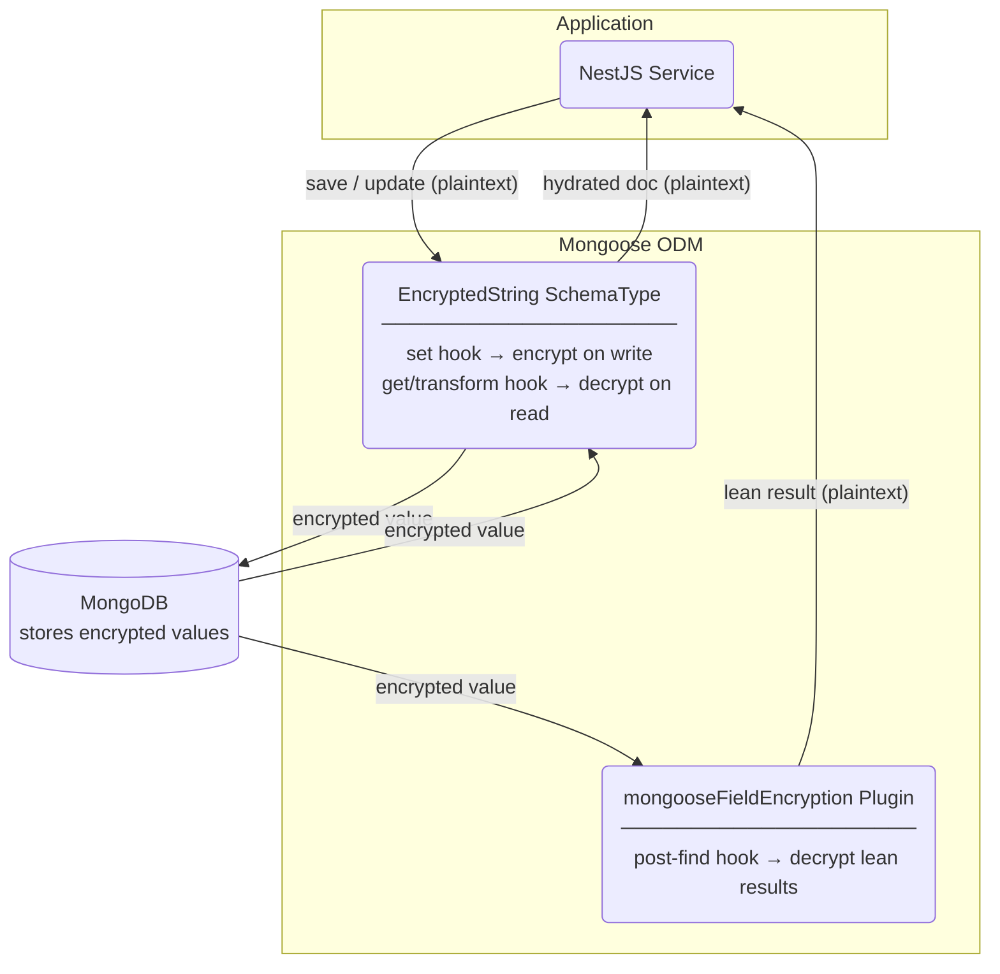

# mongoose-encrypt-fields

`mongoose-encrypt-fields` is a Mongoose [plugin](https://mongoosejs.com/docs/plugins.html) and [custom SchemaType](https://mongoosejs.com/docs/customschematypes.html) that handles field-level encryption and decryption at the ODM layer. Applications can encrypt sensitive fields transparently — no extra logic needed at the service or repository level.

Designed for use with Mongoose in NestJS.


```mermaid
flowchart TB
  subgraph app [Application]
    service(NestJS Service)
  end

  subgraph mongoose [Mongoose ODM]
    schemaType("EncryptedString SchemaType<br/>─────────────────────<br/>set hook → encrypt on write<br/>get/transform hook → decrypt on read")
    plugin("mongooseFieldEncryption Plugin<br/>─────────────────────<br/>post-find hook → decrypt lean results")
  end

  mongodb[(MongoDB<br/>stores encrypted values)]

  service -->|"save / update (plaintext)"| schemaType
  schemaType -->|encrypted value| mongodb

  mongodb -->|encrypted value| schemaType
  schemaType -->|"hydrated doc (plaintext)"| service

  mongodb -->|encrypted value| plugin
  plugin -->|"lean result (plaintext)"| service
```

## Installation

```bash
# pnpm
pnpm add mongoose-encrypt-fields
# npm
npm i mongoose-encrypt-fields
# yarn
yarn add mongoose-encrypt-fields
```

## Usage

### Basic Usage

The plugin provides `EncryptedString`, a custom [SchemaType](https://mongoosejs.com/docs/schematypes.html). Use it as the `type` for any field you want to encrypt.

```typescript
import { EncryptedString } from 'mongoose-encrypt-fields'
import { Schema } from 'mongoose' // Also accessible as Schema.Types.EncryptedString
```

Set a field's `type` to `EncryptedString`. If the underlying value isn't a string, specify the original type with `originalType` — non-string values are serialized with `EJSON.stringify()` / `EJSON.parse()` (`{ relaxed: true }`) before encryption, which is compatible with PyMongo's [json_util](https://pymongo.readthedocs.io/en/stable/api/bson/json_util.html).

```typescript
@Schema()
export class User {
  @Prop(EncryptedString) // String
  uniqueId!: string

  @Prop({ type: EncryptedString, originalType: [Number] }) // non-String
  coordinates!: number[]
}
```

`EncryptedString` also works inside subdocuments without any extra configuration.

```typescript
@Schema()
export class UserSubDocument {
  @Prop(EncryptedString)
  uniqueId!: string
}

@Schema()
export class Review {
  @Prop(UserSubDocument) // subdocument
  subUser!: UserSubDocument

  @Prop([UserSubDocument]) // subdocument array
  subUsers!: UserSubDocument[]
}
```

You also need to register your encryption functions once via `EncryptedString.setEncryptionFunctions()`. (This can be skipped if you're using the plugin, described below.)

- `encrypt` — encrypts a plaintext string
- `decrypt` — decrypts an encrypted string back to plaintext
- `isEncrypted` — returns `true` if the string is already encrypted

```typescript
const myEncrypt = (value: string): string => { /* ... */ }
const myDecrypt = (value: string): string => { /* ... */ }
const myIsEncrypted = (value: string): boolean => { /* ... */ }

// Not needed when using the plugin
EncryptedString.setEncryptionFunctions({ encrypt: myEncrypt, decrypt: myDecrypt, isEncrypted: myIsEncrypted })
```

> Most features work with the SchemaType alone. However, decryption won't work with `.lean()` queries unless the plugin is also registered.

### Plugin (Required for lean)

To decrypt fields in `.lean()` results, register the `mongooseFieldEncryption` plugin. The plugin hooks into Mongoose's post-query middleware to decrypt lean documents.

To apply the plugin per schema:

```typescript
import { mongooseFieldEncryption } from 'mongoose-encrypt-fields'

export const UserSchema = SchemaFactory.createForClass(User)

export const UserModelModule = MongooseModule.forFeatureAsync([
  {
    name: User.name,
    useFactory: async () => {
      UserSchema.plugin(mongooseFieldEncryption, {
        encrypt: myEncrypt,
        decrypt: myDecrypt,
        isEncrypted: myIsEncrypted,
      })
      return UserSchema
    },
  },
])
```

Since encrypted documents can live in any collection, it's usually easier to register the plugin globally once:

```typescript
MongooseModule.forRootAsync({
  useFactory: async () => {
    mongoose.plugin(mongooseFieldEncryption, {
      encrypt: myEncrypt,
      decrypt: myDecrypt,
      isEncrypted: myIsEncrypted,
      deduplicate: true, // prevents double-registration if called multiple times
    })
    // ...
  },
})
```

### Per-Field Encryption Functions

By default, all `EncryptedString` fields share the global encryption functions registered via `setEncryptionFunctions()` or the plugin. If you need different encryption logic per field — for example, using different KMS keys or different algorithms — you can pass `encrypt`, `decrypt`, and `isEncrypted` directly to the field's schema options.

All three functions must be provided together. Providing only some of them will throw an error.

```typescript
@Schema()
export class User {
  // Uses global encryption
  @Prop({ type: EncryptedString })
  name!: string

  // Uses a different KMS key for this field
  @Prop({
    type: EncryptedString,
    encrypt: kmsB.encrypt,
    decrypt: kmsB.decrypt,
    isEncrypted: kmsB.isEncrypted,
  })
  ssn!: string
}
```

Per-field functions work transparently across all query types, including `.lean()` and query operators like `$eq`, `$in`, and `$ne`.

### Validation & Casting

When using `originalType`, validation and casting apply before encryption — the same rules as the underlying type.

```typescript
@Schema({ _id: false })
class Phone {
  @Prop({ required: true })
  phoneNumber!: string
}

export class Place {
  @Prop()
  placeId!: string

  @Prop({ type: EncryptedString, originalType: [Phone] })
  phone!: Phone[]
}

// throws ValidationError — phoneNumber is required
await placeModel.create({ placeId: 'placeId', phone: [{}] })

// succeeds
await placeModel.create({ placeId: 'placeId', phone: [{ phoneNumber: 1234 }] })
```

Validation and casting also apply to filter and update queries:

```typescript
await placeModel.findOne({ phone: [{}] })                                          // ValidationError
await placeModel.findOne({ phone: [{ phoneNumber: 1234 }] })                       // OK
await placeModel.updateOne({ placeId: 'placeId' }, { $set: { phone: [{}] } })     // ValidationError
await placeModel.updateOne({ placeId: 'placeId' }, { $set: { phone: [{ phoneNumber: 1234 }] } }) // OK
```

### Encryption Mode

Each field can operate in one of three encryption modes, configured with the `encryptionMode` option. The default is `'both'`.

| Mode | Behavior |
|------|----------|
| `'both'` | Encrypts on write, decrypts on read (default) |
| `'encryptOnly'` | Encrypts on write, returns raw encrypted value on read |
| `'decryptOnly'` | Skips encryption on write, decrypts on read |

`'decryptOnly'` is useful for gradual encryption removal: temporarily set the mode to `'decryptOnly'` so reads still decrypt existing data, but new writes are stored as plaintext. Once migration is complete, remove the encryption settings entirely.

```typescript
@Schema()
export class User {
  @Prop({ type: EncryptedString, encryptionMode: 'decryptOnly' })
  uniqueId!: string
}
```

### Discriminators

Mongoose discriminators are supported. Usage is the same as the basic setup.

```typescript
@Schema({ _id: false })
export class Location {
  @Prop({ required: true })
  type!: string

  @Prop({ required: true, type: EncryptedString, originalType: [Number] })
  coordinates!: number[]
}

@Schema({ _id: false })
export class LocationWithoutEncryption extends Location {
  @Prop([Number])
  coordinates!: number[]
}

@Schema()
export class GPSCheckIn implements CheckIn {
  type!: string

  @Prop(Location)
  location!: Location
}

@Schema()
export class PlaceCheckIn implements CheckIn {
  type!: string

  @Prop(LocationWithoutEncryption)
  location!: LocationWithoutEncryption
}

@Schema({ discriminatorKey: 'type' })
export class CheckIn {
  @Prop()
  type!: string
}
export const CheckInSchema = SchemaFactory.createForClass(CheckIn)

export const CheckInModelModule = MongooseModule.forFeatureAsync([
  {
    name: CheckIn.name,
    useFactory: async () => CheckInSchema,
    discriminators: [
      { value: CheckInType.GPS, name: GPSCheckIn.name, schema: GPSCheckInSchema },
      { value: CheckInType.PLACE, name: PlaceCheckIn.name, schema: PlaceCheckInSchema },
    ],
  },
])
```

When using a discriminator schema inside a subdocument, the `type` must be set to the schema object (not the class). Mongoose needs the schema reference to resolve discriminator information.

```typescript
export class Review {
  @Prop({ type: CheckInSchema }) // schema object, not class
  checkIn?: CheckIn
}
```

### Aggregate

Aggregate queries are not supported — encrypted fields will not be automatically decrypted in aggregation pipelines.

## License

mongoose-encrypt-fields is released under the [MIT license](https://github.com/naver/mongoose-encrypt-fields/blob/main/LICENSE).

```
mongoose-encrypt-fields
Copyright 2024-present NAVER Corp.

Permission is hereby granted, free of charge, to any person obtaining a copy
of this software and associated documentation files (the "Software"), to deal
in the Software without restriction, including without limitation the rights
to use, copy, modify, merge, publish, distribute, sublicense, and/or sell
copies of the Software, and to permit persons to whom the Software is
furnished to do so, subject to the following conditions:

The above copyright notice and this permission notice shall be included in
all copies or substantial portions of the Software.

THE SOFTWARE IS PROVIDED "AS IS", WITHOUT WARRANTY OF ANY KIND, EXPRESS OR
IMPLIED, INCLUDING BUT NOT LIMITED TO THE WARRANTIES OF MERCHANTABILITY,
FITNESS FOR A PARTICULAR PURPOSE AND NONINFRINGEMENT. IN NO EVENT SHALL THE
AUTHORS OR COPYRIGHT HOLDERS BE LIABLE FOR ANY CLAIM, DAMAGES OR OTHER
LIABILITY, WHETHER IN AN ACTION OF CONTRACT, TORT OR OTHERWISE, ARISING FROM,
OUT OF OR IN CONNECTION WITH THE SOFTWARE OR THE USE OR OTHER DEALINGS IN
THE SOFTWARE.
```
